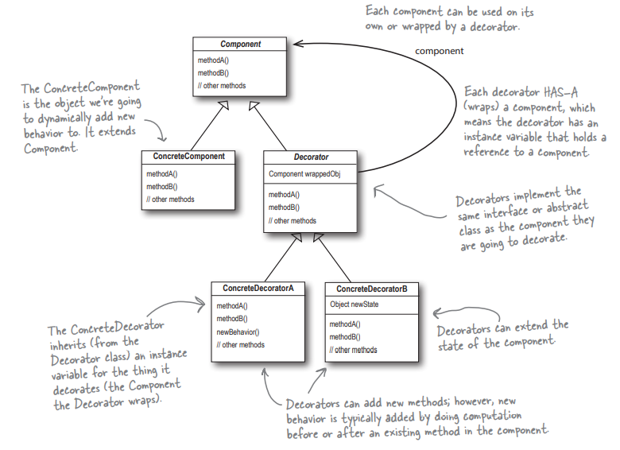
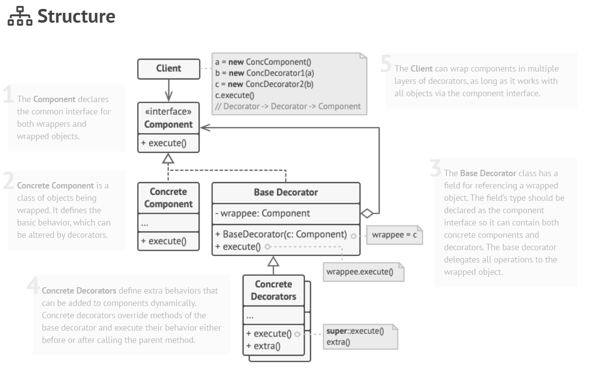

## Decorator Pattern
## It is a type of Structural Pattern

**Decorator Pattern helps in attaching additional responsibility to an object dynamically. Decorators provide flexible alternatives
to subclassing for extending functionality.**

### Applicability
Use the Decorator pattern when you need to be able to assign extra behaviors to objects at runtime without breaking the code that uses these objects.

The Decorator lets you structure your business logic into layers, create a decorator for each layer and compose objects with various combinations of this logic at runtime. The client code can treat all these objects in the same way, since they all follow a common interface.

Use the pattern when it’s awkward or not possible to extend an object’s behavior using inheritance.

Many programming languages have the final keyword that can be used to prevent further extension of a class. For a final class, the only way to reuse the existing behavior would be to wrap the class with your own wrapper, using the Decorator pattern.

### How to Implement
1) Make sure your business domain can be represented as a primary component with multiple optional layers over it. 
2) Figure out what methods are common to both the primary component and the optional layers. Create a component interface and declare those methods there. 
3) Create a concrete component class and define the base behavior in it. 
4) Create a base decorator class. It should have a field for storing a reference to a wrapped object. The field should be declared with the component interface type to allow linking to concrete components as well as decorators. The base decorator must delegate all work to the wrapped object. 
5) Make sure all classes implement the component interface. 
6) Create concrete decorators by extending them from the base decorator. A concrete decorator must execute its behavior before or after the call to the parent method (which always delegates to the wrapped object). 
7) The client code must be responsible for creating decorators and composing them in the way the client needs.

### Pros
1) You can extend an object’s behavior without making a new subclass. 
2) You can add or remove responsibilities from an object at runtime. 
3) You can combine several behaviors by wrapping an object into multiple decorators. 
4) Single Responsibility Principle. You can divide a monolithic class that implements many possible variants of behavior into several smaller classes.

### Cons
1) It’s hard to remove a specific wrapper from the wrappers stack. 
2) It’s hard to implement a decorator in such a way that its behavior doesn’t depend on the order in the decorators stack. 
3) The initial configuration code of layers might look pretty ugly.