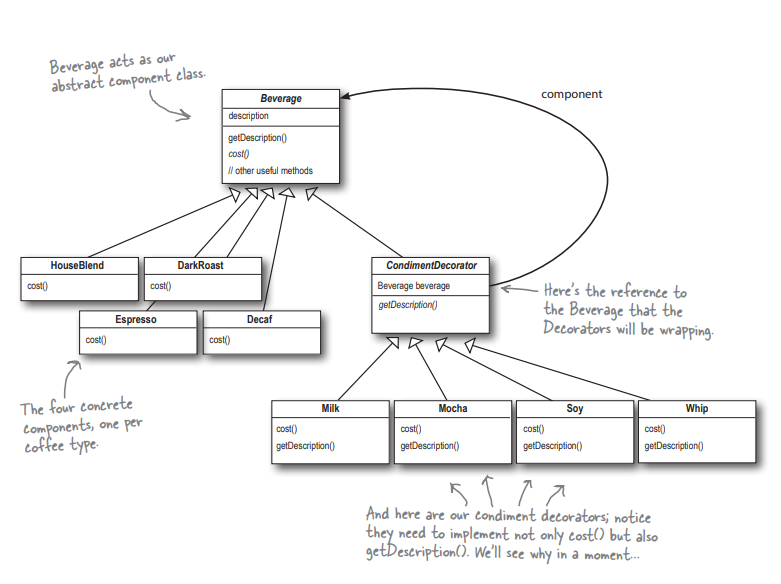

## Problem and Approach for the Weather Data Application
1) We have a requirement to extend our existing coffee application, which provides 4 types of beverages.
2) Now we need to add functionality to support 4 different type of addOns on our beverages.
3) First solution which we can think of is extending the same base class with new combinations of beverages with addOns.
4) But due to this approach there can be multiple subclasses of the base class and will result class explosion.
5) The other approach will be to add the addOns as instance variables in the base class.
6) With this approach, we solve the problem of class explosion but then what if we have a beverage which don't support any type of addOn.
7) In this case we will provide additional unnecessary data to the subclass.
8) So we can use a decorator pattern, which can help us decorate our objects of beverages with different addOns as needed dynamically at runtime.
9) We can have a common interface/abstract base class which will be extended by the 4 main beverages.
10) Also, we will create decorator abstract class extending the base class so that we can have type matching for decorator classes as well. Since we can pass decorated objects in place of main objects.
11) Decorator abstract class will have reference to the object which it will decorate, here we are favoring composition over inheritance.
12) Then each addOn will extend and implement decorator abstract class with additional functionalities.
13) For creating any new beverage with given specification we can decorate the base beverage with as many decorators we want.

