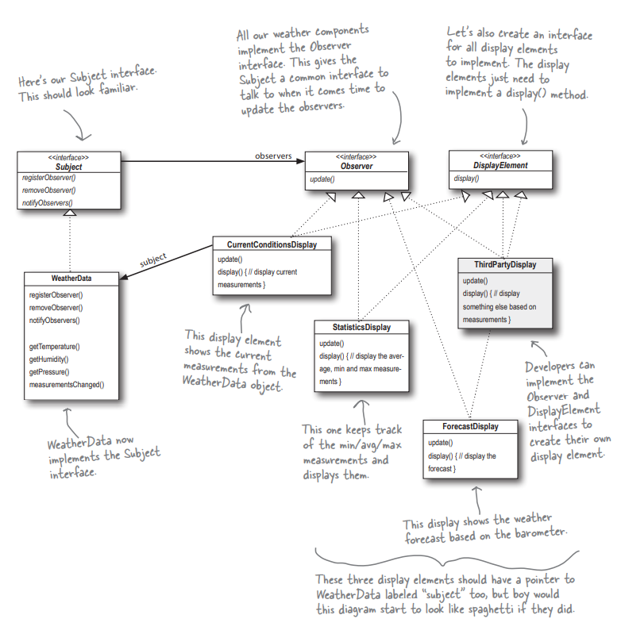

## Problem and Approach for the Weather Data Application
1) We have requirement to create three displays for a weather application, which takes temperature, humidity and pressure as input from the sensors.
2) Then the three displays in the application should show current conditions, statistics data for a period of time and forecast conditions.
3) Whenever weather data app receives new inputs from the sensors the three displays should work on the new input and display the information accordingly.
4) We have a boilerplate code which our client wants us to implement/use for this feature.
5) First thought would be to create three display classes taking these three inputs and processing them. We will be creating new objects of these classes in the class which the client has provided us and will call them directly from this class.
6) The problem with this approach is that if we want to add more displays in the app in future then we need to make changes to the main class as well, and it may result in breaking the existing functionality.
7) These three displays are tightly coupled with the main class, and making changes in these three classes or removing any one of the class will also result in code changes to main class and might even break the existing functionality.
8) Here Observer Pattern can help us, since there will be one subject holding the state in our case it is the three inputs and if the state changes the subject will notify all the dependent objects (3 displays) and they will update automatically.
9) With Observer pattern we can add or remove any observer from the observing list whenever needed, and it won't impact the main class.
10) The only thing is that the observers should implement the Observer interface and then register themselves to the Subject for listening all the changes.
11) At runtime based on any condition we can also remove the observer from listening the subject.
12) Also in future if we want to add more displays than that display should just implement Observer interface and then register itself to the Subject. It will start getting notifications of the state change.
13) Also while implementing the Observer Pattern, we are focusing on one new Design Principle **Strive for loosely coupled designs between objects that interact**.
14) Loosely coupled designs help us to build flexible OO design systems that can handle changes better since we have minimized the interdependency between the objects.
15) In Observer pattern same object can be an observer for one task and subject for the other task.
16) Each observer and subject can focus on any other things as well without impacting each other.
17) Any change to subject or observer won't impact the other.
18) Observers of any concrete type can participate in the pattern as long as they implement the Observer interface. 
19) Observers are loosely coupled in that the Subject knows nothing about them, other than that they implement the Observer interface. 
20) You can push or pull data from the Subject when using the pattern (pull is considered more “correct”).

