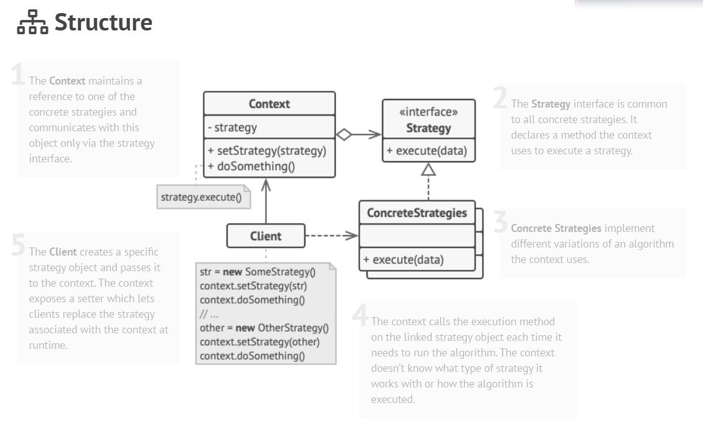

## Strategy Pattern
## It is a type of Behavioral Pattern.

**The Strategy Pattern defines a family of algorithms and encapsulates each one.
These set of algorithms are interchangeable. Also, Strategy lets the algorithm vary independently of the client that uses it.**

### Applicability
Use the Strategy pattern when you want to use different variants of an algorithm within an object and be able to switch from one algorithm to another during runtime.

The Strategy pattern lets you indirectly alter the object’s behavior at runtime by associating it with different sub-objects which can perform specific sub-tasks in different ways.

Use the Strategy when you have a lot of similar classes that only differ in the way they execute some behavior.

The Strategy pattern lets you extract the varying behavior into a separate class hierarchy and combine the original classes into one, thereby reducing duplicate code.

Use the pattern to isolate the business logic of a class from the implementation details of algorithms that may not be as important in the context of that logic.

The Strategy pattern lets you isolate the code, internal data, and dependencies of various algorithms from the rest of the code. Various clients get a simple interface to execute the algorithms and switch them at runtime.

Use the pattern when your class has a massive conditional statement that switches between different variants of the same algorithm.

The Strategy pattern lets you do away with such a conditional by extracting all algorithms into separate classes, all of which implement the same interface. The original object delegates execution to one of these objects, instead of implementing all variants of the algorithm.

### How to Implement
In the context class, identify an algorithm that’s prone to frequent changes. It may also be a massive conditional that selects and executes a variant of the same algorithm at runtime.

Declare the strategy interface common to all variants of the algorithm.

One by one, extract all algorithms into their own classes. They should all implement the strategy interface.

In the context class, add a field for storing a reference to a strategy object. Provide a setter for replacing values of that field. The context should work with the strategy object only via the strategy interface. The context may define an interface which lets the strategy access its data.

Clients of the context must associate it with a suitable strategy that matches the way they expect the context to perform its primary job.

### Pros
You can swap algorithms used inside an object at runtime.

You can isolate the implementation details of an algorithm from the code that uses it.

You can replace inheritance with composition.

Open/Closed Principle. You can introduce new strategies without having to change the context.

### Cons
If you only have a couple of algorithms and they rarely change, there’s no real reason to overcomplicate the program with new classes and interfaces that come along with the pattern.

Clients must be aware of the differences between strategies to be able to select a proper one.

A lot of modern programming languages have functional type support that lets you implement different versions of an algorithm inside a set of anonymous functions. Then you could use these functions exactly as you’d have used the strategy objects, but without bloating your code with extra classes and interfaces.