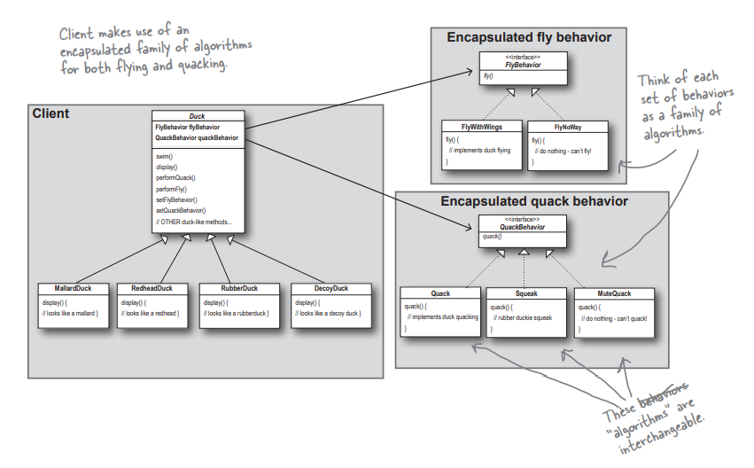

## Problem and Approach for SimUDuck App (Head First design patterns)
1) We have a duck app which works seamlessly for last 1 year. In this we have duck base class and several subclass extends this.
2) Now we need to add a new feature in the app so that ducks can start flying.
3) So as an OO programmer the first thought would be to add fly method directly in the base class. So that all ducks have flying feature.
4) But the problem is say we have a subclass of duck called rubber ducks and logically these ducks should not fly. But due to our above approach these also started flying. So this approach doesn't work.
5) Now the second thought is to make this fly method abstract and subclasses will override and give their own implementations.
6) But due to this suppose in future we need to make a fix in fly feature then we need to goto each class and see what's the existing behaviour and whether it needs to be changed or not.
7) So due to this it would be difficult to maintain the code.
8) Now the third approach, is to make a flyable interface and each subclass can implement it if needed.
9) But the here also we have one problem, suppose there are certain subsets of duck subclasses which have same fly behavior then there will be a lot of code duplicacy.
10) And maintaining this duplicate code in multiple classes will be a difficult task.
11) Now here comes the first design principle, "Encapsulate What varies".
12) Since our fly behavior is changing frequently and other things in the duck class remains same most of the time. We can move out the fly behaviour from duck class.
13) We will again create a flyable interface but this time, rather than ducks implementing this behaviour we will have concrete implementation class that will implement this behavior.
14) So instead of inheritance we will use composition of these behaviours according to their concrete implementations and need of subclass.
15) Duck class will have reference to these behaviors via the flyable interface and will have a setter to set the flying behaviour at runtime.

